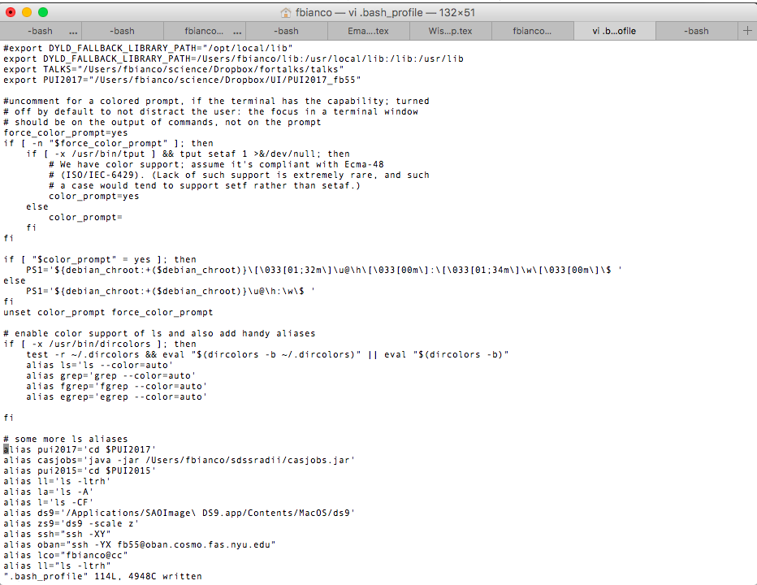

# Assignment 2: 

CONTEXT:

*Environmental variables* define values that are known by any application/software in your environment (including python, editors, etc). Think about them as a shortcut that everyone knows.

*Aliases* are similar to environmental variables, but are executables: instead of being a shortcut to a variable (which could be a location on our computer as it is the case in this eercise)  it is a shortcut to a command

The help maintaining security as you do not have to reveal the full path to your data or code to use it, and they facilitate collaboration cause two people can work on a project on their machine, refer to the same variable, and have it associated to a different path, unique to the user. As long as we agree on what the env variables are defined to be. For example: I can define a place for the data to be used in PUI class as 

```$PUIdata```

on my computer that is /User/fbianco/PUIdata. But you do not have a /User/fbianco on your computer, you have a /User/<yourname> . However, if my code refers to $PUIdata and you have defined a place
  
```export PUIdata="/User/<myname>/PUIdata"``` which contains the same datasets you can use my code without modifying it.


To access your terminal on a mac you can use command space and type terminal

To access your terminal on the docker follow Mr. Sharma's instructions

To access your terminal on the ADRF follow [these instructions](http://cusp.adrf.cloud/terminal)

For relevant bash commands see [this slide deck](https://speakerdeck.com/62gerente/bash-introduction)
and this [cheat sheet](https://github.com/fedhere/UInotebooks/blob/master/BashCommands.md)

**Set up your environment:**

1. create a directory on your computer or on your workspace on CUSP compute called PUI2018. 

to create a folder use the *mkdir* command (refer to the [cheat sheet](https://github.com/fedhere/UInotebooks/blob/master/BashCommands.md)) or Mohit's slides.


2. create an environmental variable PUI2018 that points to that directory (the full directory path starting with /home on a linux box, and with /Users on a mac etc. You can retrieve that path by getting into the folder you just created with the command *cd*  - which stands for "change directory" - and then type *pwd* - which stands for "present working directory"). Once your env variable is set up typing on the terminal:

```
echo $PUI2018
```

you will see the full path to the directory printed on the terminal. 

The syntax to save an environemntal variable is 

```export VARNAME="<var end point>" ```

This sets up an environmental variable for the current sessions only: if you close this terminal your variable will be lost. To save it permanently you want to copy write the same line of code on  ~/.bashrc (linux) or ~/.bash_profile (OS X) so that every time you open a new terminal the terminal knows what the $PUI2018 env var is set to. (the ~ means your home directory. You must edit the .bashrc and file that is in your home directory for this to work!) 

You can use any editor you like. The easiest solution is to use the browser on the ADRF or on the ucsl docker. Once you see the browser open a terminal 


    
and add the line that defines the environmental variable (same like you typed in the shell earlier)

Now create an *alias* such that typing 

```
pui2018
```

takes you to that directory. Aliases are shorcuts to commands (hint: the alias should use the *cd* command). Use the env variable $PUI2018 in that command! 

The syntax to create an alias is similar to that for an env variable:

```alias alias_name="<alias command>" ```

Take a screenshot of your .bashrc/.bash_profile file where one can see the alias and env. variable you created. Type this series of commands on the terminal:

``` 
pwd

pui2018

pwd
```
Take a screenshot of your terminal that shows this series of commands and their output. 

**not due this week **

Next week we will use this to connect a local directory to a github repository. we will set up go to github online and CREATE A NEW GITHUB REPO CALLED PUI2018_\<NYUid\> ( this for me would be PUI2018_fb55: https://github.com/fedhere/PUI2018_fb55 ). We will follow the github directions to create a repository on the command line on your local machine.  Notice that in this case you are working in the reverse order compared to the lab: you create the first instance of the repository on the remote server (on the web) and then you create a local repo to link to it on your machine. Follow the steps indicated by github to create the repo, a README.md file, and to link the online and local repos. 

We will modify your README.md file: edit the copy on your machine to have it describe what you did to set up your enviroment and upload the screenshots I directed you to take above, so that they are displayed in your README.md (like in the image below). The README.md is a “markdown”file. To see what the syntax to upload an image in a markdown file, or in general to format the text, you can look at the README.md file in my PUI2015_fbianco repository (link above, and image below) and if you look at the raw file by clicking the Raw button on the top right you can see the syntax. 
Remember that you also need to upload the images in your remote directory for them to be displayed in your README! just like any file you add them by git add and git commit, git push.

Your repository should automatically show the images 




My bash_profile is complicated. Yours will likely be shorter and simpler. But in mine you should be able to spot the export line and the alias line for PUI2018.


NOTE: after you modify your .bashrc or .bash_profile you will have to rerun it: 
```
source .bashrc 
```

for the new set up to be incorporated in your environment. However, every new bash terminal you open will automatically read the .bashrc/.bash_profile and know about your new alias/env variables
