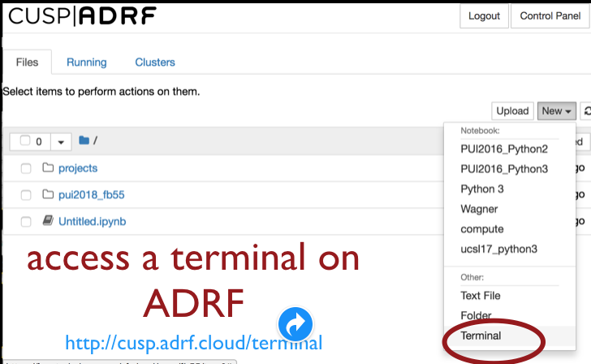
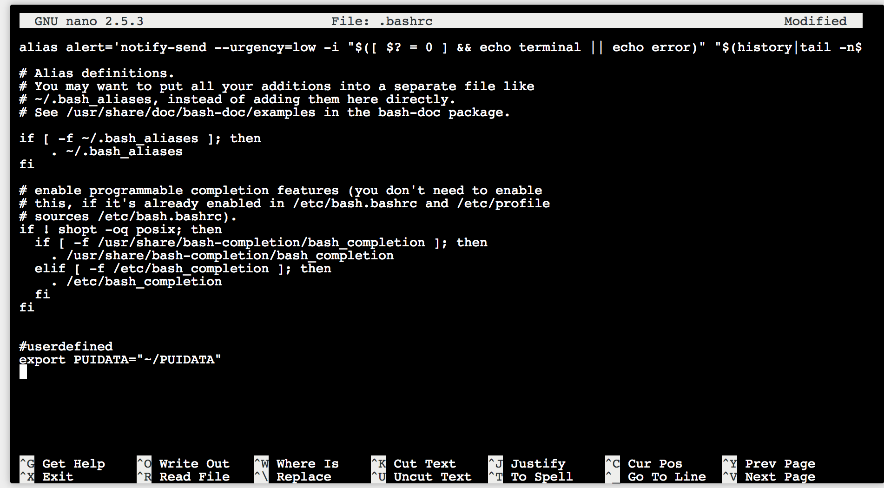

# Assignment 2: 

* Note: you do not have to do this on the docker. You can do this on ANY *bash* terminal you have access to. If you have a mac or linux your native terminal should be set to *bash*. If you have set up the docker the terminal you get from the docker on the browser is a *bash* terminal. If you are on the ADRF you have access to a *bash* terminal on the jupyter hub. Instructions follow to access these terminals.

CONTEXT:

*Environmental variables* define values that are known by any application/software in your environment (including python, editors, etc). Think about them as a shortcut that everyone knows. Your env var can point a number or a string, and that string may be a path (the full name of a folder or file).

*Aliases* are similar to environmental variables, but are executables: instead of being a shortcut to a variable it is a shortcut to a command.

They help *maintaining security* as you do not have to reveal the full path to your data or code to use it, and they *facilitate collaboration* cause two people can work on a project on their machine, refer to the same variable, and have it associated to a different path, unique to the user. As long as we agree on what the env variables are defined to be. For example: I can define a place for the data to be used in PUI class as 

```$PUIdata```

on my computer: the PUIdata environmental variable "stands for" /User/fbianco/PUIdata. (note that the $ is not part of the name but a way to tell terminal that I am referring to the environmental variable PUIdata as opposed to just the series of letters PUIdata) But you do not have a /User/fbianco on your computer, you have a /User/\<yourname\> . However, if my code refers to $PUIdata and you have defined a place by
  
```export PUIdata="/User/<user_name>/PUIdata"``` which contains the same datasets you can use my code without modifying it if my code used PUIdata instead of the extended path.

**Access a bash terminal**

To access your terminal on the docker follow Mr. Sharma's instructions

To access your terminal on a mac you can use *command+space* and type terminal

To access your terminal on the CUSP ADRF follow [these instructions](http://cusp.adrf.cloud/terminal)

The easiest solution is to use the browser on the ADRF or on the ucsl docker. Once you see the browser open a terminal 


    
and add the line that defines the environmental variable (same like you typed in the shell earlier)

For relevant *bash* commands see this [cheat sheet](https://github.com/fedhere/UInotebooks/blob/master/BashCommands.md), (mine and Mohit's slides) [https://github.com/fedhere/UInotebooks/blob/master/slides2018/UI1_PUI2018.pdf], [this slide deck](https://speakerdeck.com/62gerente/bash-introduction).

**Set up your environment:**

1. create a directory on your computer or on your workspace on the CUSP ADRF called PUI2018. 

to create a folder use the *mkdir* command (refer to the [cheat sheet](https://github.com/fedhere/UInotebooks/blob/master/BashCommands.md)) or Mohit's slides.


2. create an environmental variable PUI2018 that points to that directory (the full directory path starting with /home on a linux box, and with /Users on a mac etc. You can retrieve that path by getting into the folder you just created with the command *cd* , which stands for "change directory",  and then type *pwd* , which stands for "present working directory"). Once your env variable is set up typing on the terminal:

```
echo $PUI2018
```

you will see the full path to the directory printed on the terminal. 

The syntax to create an environemntal variable is 

```export VARNAME="<var end point>" ```

Note that by convention environmental variables' names are all caps. 

This sets up an environmental variable for the current sessions only: if you close this terminal your variable will be lost. To save an environmental variable *permanently* you want to write the same line of code in a file, specifically the on  ~/.bashrc (linux) or ~/.bash_profile (OS X) so that every time you open a new terminal that terminal and any processes started there (e.g. a python script or jupyter notebook) know what the $PUI2018 environmental variable is set to (the ~ in ~/.bashrc means your home directory. The file name is just .bashrc, but you need the full path to access the .bashrc/.bash_profile file in your home directory. You must edit the .bashrc and file that is in your home directory for this to work! This is because the .bashrc file in your home directory is read by any terminal you start when you start it, while a local .bashrc file would not be.) 

You can use any editor you like. For example on the ADRF and likely on your mac you can use nano: on the terminal type 

```nano .bashrc```

**WARNING: there are important lined of code in the file that you just opened! do not touch any of the content you find, scroll all the way to the bottom and add your lines of code there**

it should look something like this




Now create an *alias* such that typing 

```
pui2018
```

takes you to that directory. Aliases are shorcuts to commands (hint: the alias you are creating should use the *cd* command). And make sure you use the env variable $PUI2018 in that command so that if you change the loaction of your PUI2018 file you do not have to edit both the environmental variable and the alias! 

The syntax to create an alias is similar to that for an env variable:

```alias alias_name="<alias command>" ```
Now take a screenshot of your .bashrc ot .bash_profile file where one can see the alias and env. variable you created. *This will be part of your deliverable for this week homework.* Upload the screenshot on blackboard

Before you proceed you need your terminal to read the new version of the file as you modified it and store the new env variable and alias (again, from now on any new terminal will do this automatically at start, but this terminal was already started.)

Type

```source ~/.bashrc``` 

or 

```source ~/.bash_profile``` if you are using the native mac terminal.

Type this series of commands on the terminal. 

``` 
pwd

pui2018

pwd
```
Take a screenshot of your terminal that shows this series of commands and their output. Upload the screenshot on blackboard

for the new set up to be incorporated in your environment. However, every new bash terminal you open will automatically read the .bashrc/.bash_profile and know about your new alias/env variables


**not due this week **

Next week we will use this to connect a local directory to a github repository. we will set up go to github online and CREATE A NEW GITHUB REPO CALLED PUI2018_\<NYUid\> ( this for me would be PUI2018_fb55: https://github.com/fedhere/PUI2018_fb55 ). We will follow the github directions to create a repository on the command line on your local machine.  Notice that in this case you are working in the reverse order compared to the lab: you create the first instance of the repository on the remote server (on the web) and then you create a local repo to link to it on your machine. Follow the steps indicated by github to create the repo, a README.md file, and to link the online and local repos. 

We will modify your README.md file: edit the copy on your machine to have it describe what you did to set up your enviroment and upload the screenshots I directed you to take above, so that they are displayed in your README.md (like in the image below). The README.md is a “markdown”file. To see what the syntax to upload an image in a markdown file, or in general to format the text, you can look at the README.md file in my PUI2015_fbianco repository (link above, and image below) and if you look at the raw file by clicking the Raw button on the top right you can see the syntax. 
Remember that you also need to upload the images in your remote directory for them to be displayed in your README! just like any file you add them by git add and git commit, git push.

Your repository should automatically show the images 


My bash_profile is complicated. Yours will likely be shorter and simpler. But in mine you should be able to spot the export line and the alias line for PUI2018.


